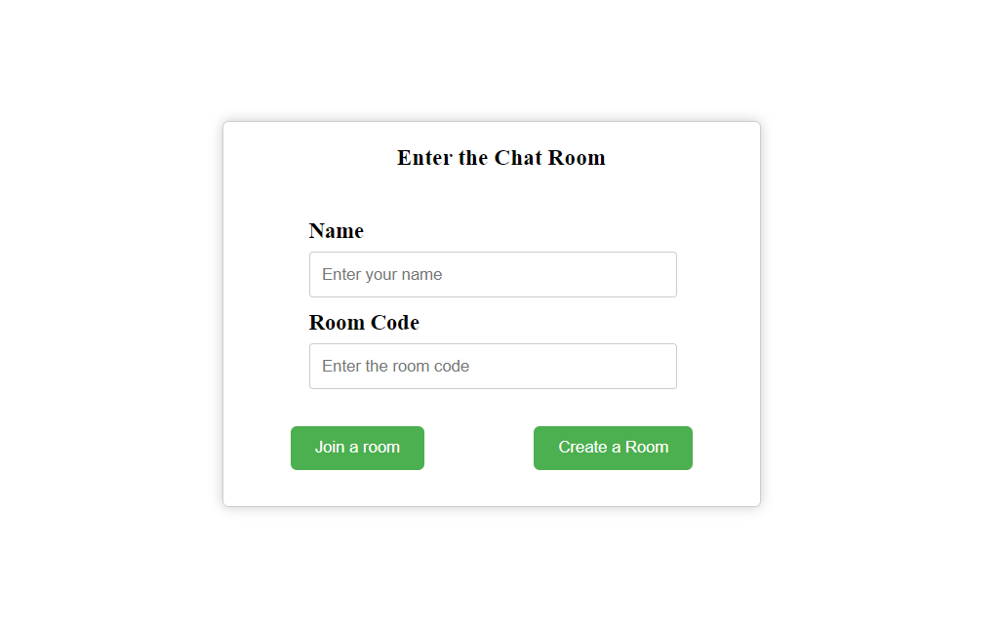
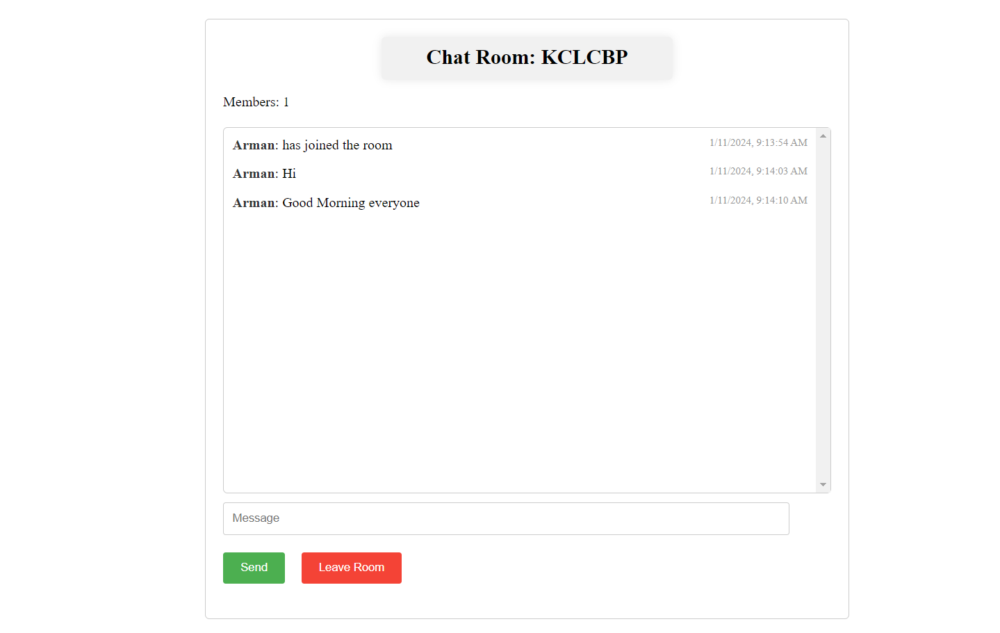

# LiveChatRoom

This is a real-time chat application built using Flask and SocketIO. The application allows users to create chat rooms, join existing ones, send messages, and track the number of members in each room.

## Features

- **Room Creation:** Users can create new chat rooms with a unique code.
- **Room Joining:** Participants can join existing rooms by entering the room code.
- **Real-time Messaging:** Messages are sent and received in real-time using SocketIO.
- **Member Tracking:** The application dynamically tracks the number of members in each room.
- **User-friendly Interface:** A simple and minimal user interface for a seamless chat experience.

## ScreenShots




## Getting Started

1. **Clone the Repository:**

   ```bash
   git clone https://github.com/Armancollab/LiveChatRoom.git
   cd LiveChatRoom
   ```

2. **Install Dependencies:**

   ```bash
   pip install -r requirements.txt
   ```

3. **Run the Application:**

   ```bash
   python main.py
   ```

4. **Open in Browser:**
   Visit `http://localhost:5000` in your web browser.

## Usage

- On the homepage, enter your name and choose to join an existing room or create a new one.
- If creating a new room, a unique room code will be generated for you.
- Enter the room code to join an existing room.
- Enjoy real-time chat with other members in the room.

Happy Chatting!
